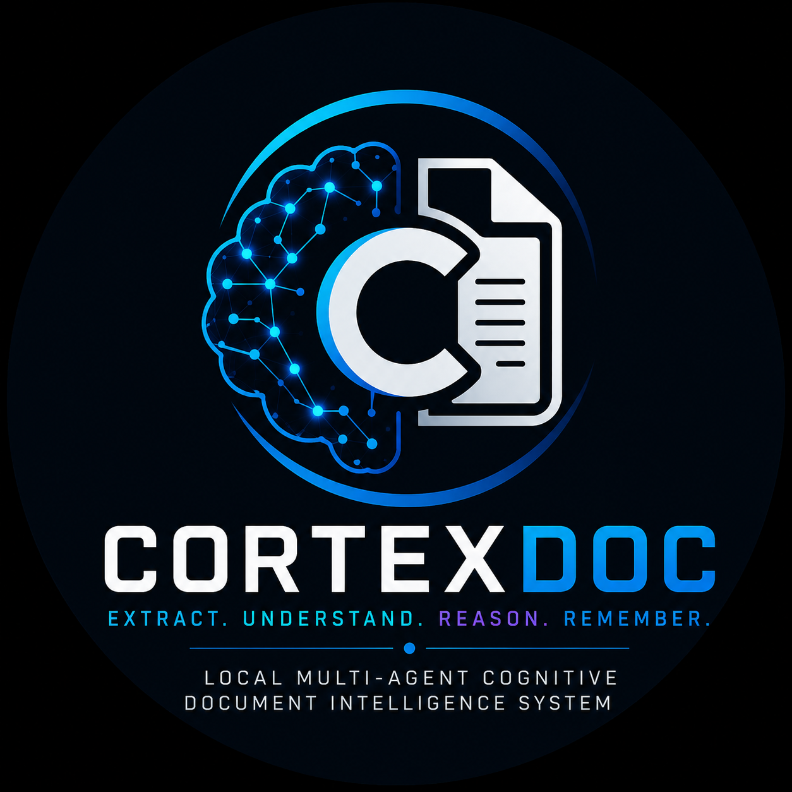
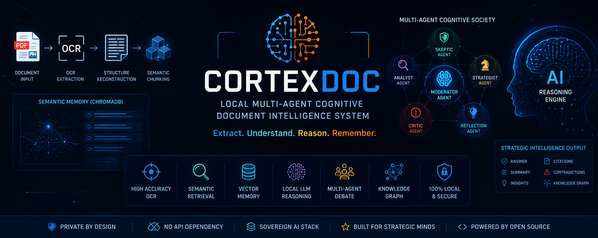
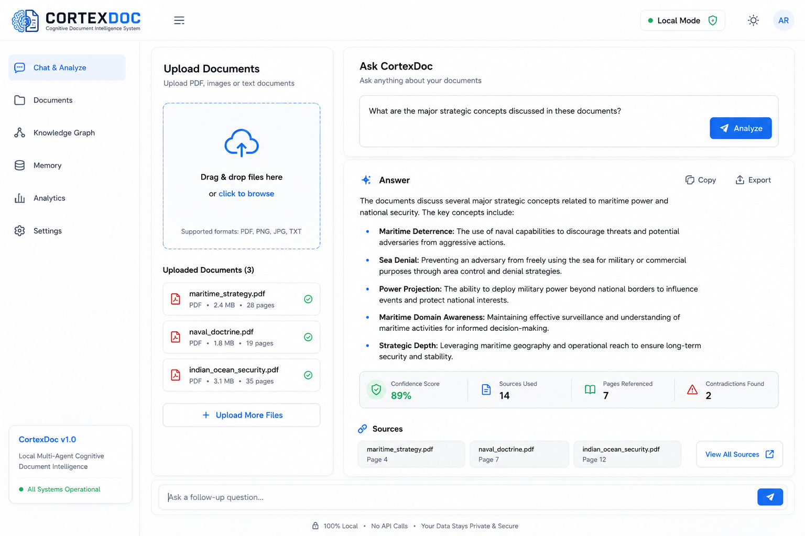
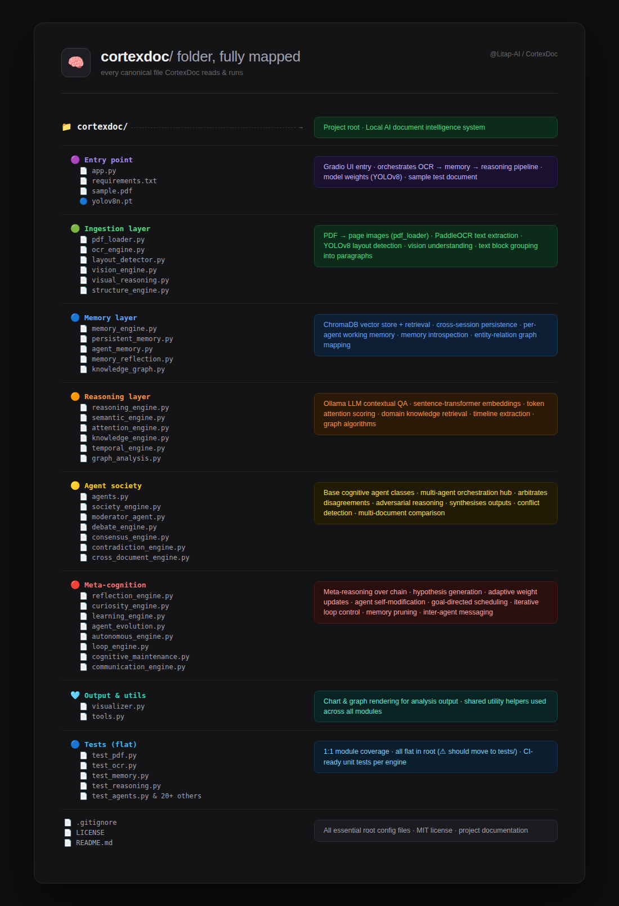
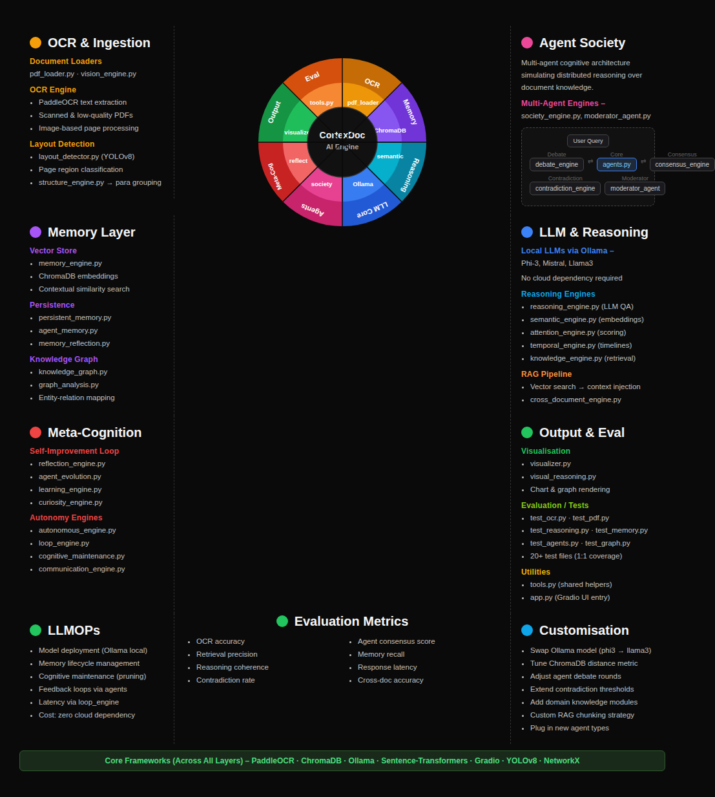
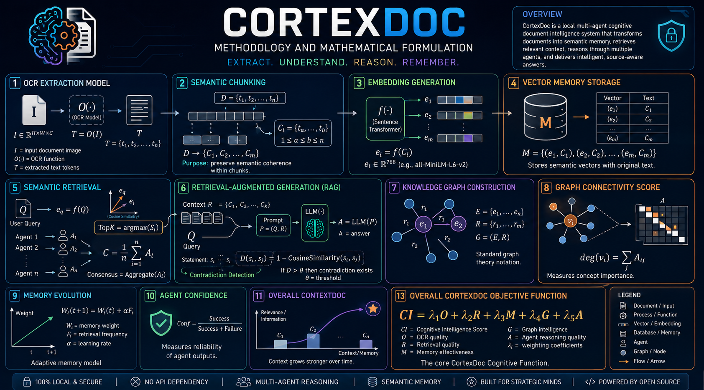

<p align="center">
  
</p>

<h1 align="center">CortexDoc</h1>

<p align="center">
Local Multi-Agent Cognitive Document Intelligence System
</p>

# CortexDoc
<p align="center">
  
</p>

<p align="center">


</p>

---

<h1 align="center">
🧠 CortexDoc
</h1>

<h3 align="center">
Local Multi-Agent Cognitive Document Intelligence System
</h3>

---

<p align="center">

<a href="#features">

</a>

<a href="#installation">

</a>

<a href="#system-architecture">

</a>

<a href="#future-roadmap">

</a>

</p>

---

# CortexDoc

### Local Multi-Agent Cognitive Document Intelligence System

CortexDoc is an advanced AI-powered document intelligence framework designed for deep semantic understanding, reasoning, and analysis of complex documents.

Unlike traditional OCR pipelines that merely extract text, CortexDoc transforms raw documents into structured cognitive memory that can be queried, reasoned upon, debated, and analyzed through autonomous AI agents.

The system combines:

* OCR intelligence
* semantic retrieval
* vector memory
* multi-agent cognition
* local LLM reasoning
* strategic document analysis

All running locally.

---
## User Interface




# Features

## OCR-Based Cognitive Extraction

Uses PaddleOCR for high-accuracy text extraction from:

* PDFs
* scanned documents
* images
* low-quality scans

---

## Semantic Memory Engine

Documents are converted into vectorized semantic memory using ChromaDB for:

* contextual retrieval
* long-term memory
* intelligent querying
* similarity search

---

## Multi-Agent Cognitive Architecture

CortexDoc introduces a society of reasoning agents capable of:

* analysis
* critique
* debate
* evaluation
* contradiction detection
* reflective reasoning

Agents simulate distributed cognition over document knowledge.

---

## Local LLM Integration

Integrated with Ollama-based local language models such as:

* Phi-3
* Mistral
* Llama3

No cloud dependency required.

---

## Strategic Intelligence Capability

Designed especially for:

* defence studies
* geopolitical analysis
* maritime strategy
* doctrine comparison
* intelligence extraction
* policy analysis

---

## Architecture




---

# Tech Stack

## AI / ML

* PaddleOCR
* Ollama
* ChromaDB
* Sentence Transformers

## Backend

* Python
* Gradio


## Cognitive Society


---

# Installation

## Clone Repository

```bash
git clone https://github.com/YOUR_USERNAME/CortexDoc.git
cd CortexDoc
```

---

## Create Virtual Environment

```bash
python -m venv venv
source venv/bin/activate
```

---

## Install Dependencies

```bash
pip install -r requirements.txt
```

---

# Install Ollama

Download Ollama:

https://ollama.com/download

Pull a model:

```bash
ollama pull phi3
```

---

# Run CortexDoc

```bash
python app.py
```

Open browser:

```text
http://127.0.0.1:7860
```

---

# Example Queries

```text
What is this document about?

Summarize the strategic concepts discussed.

Identify contradictions in the doctrine.

Compare strategic priorities across documents.

Extract military or geopolitical themes.
```

---
## Mathematical Framework



---

# Current Capabilities

* OCR extraction
* semantic retrieval
* local reasoning
* vector memory
* contextual QA
* multi-agent architecture
* strategic analysis pipeline

---

# Future Roadmap

* Multi-document cognition
* autonomous research agents
* knowledge graph visualization
* contradiction heatmaps
* agent memory evolution
* real-time collaborative reasoning
* doctrine intelligence engine
* strategic forecasting models

---

# Why CortexDoc?

Most document AI systems stop at extraction.

CortexDoc moves toward:

* cognition
* reasoning
* memory
* strategic interpretation
* autonomous analytical systems

The project explores how AI systems can evolve from passive text processors into active cognitive architectures.

---

# License

MIT License

---

# Author

ROHIT PATIL
